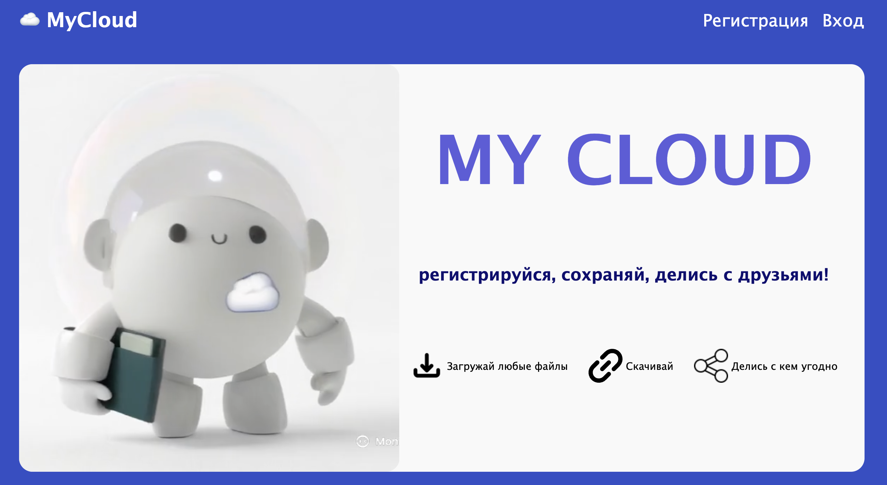
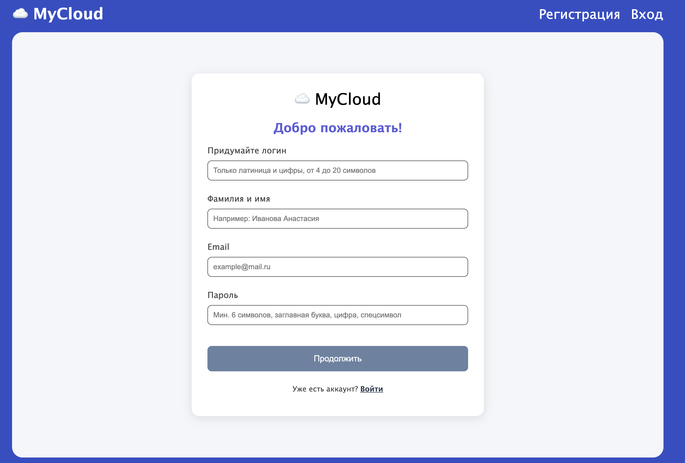
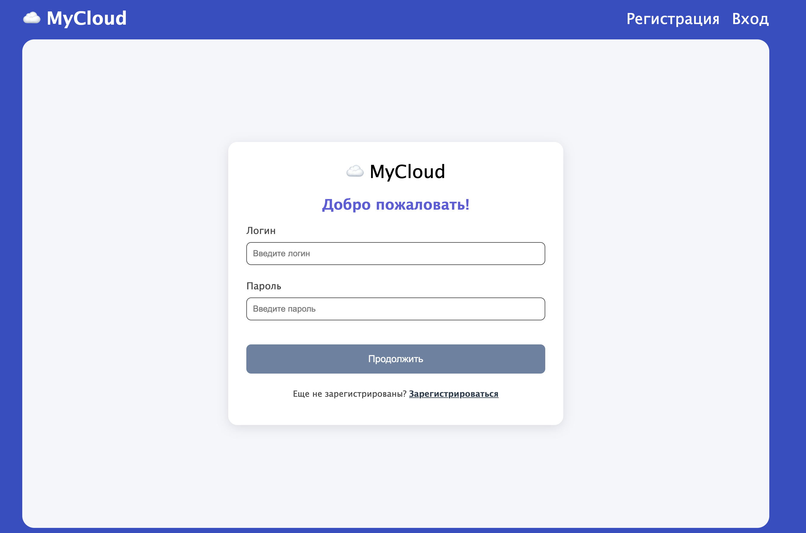
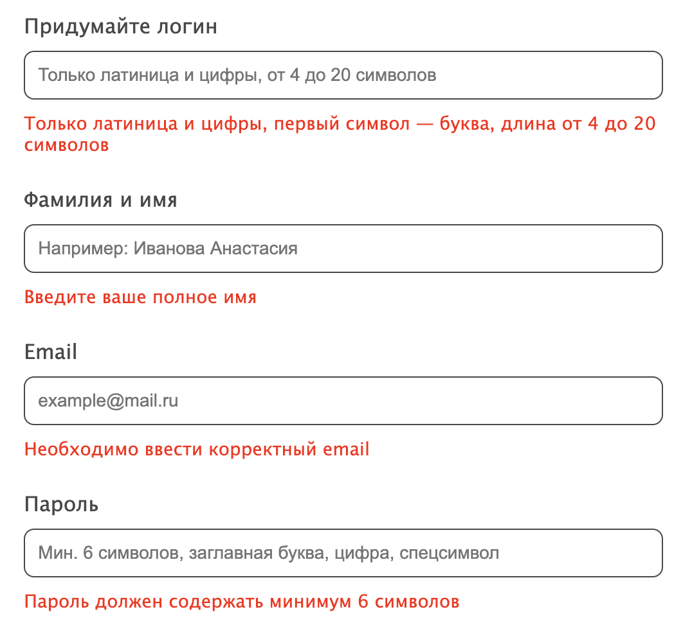
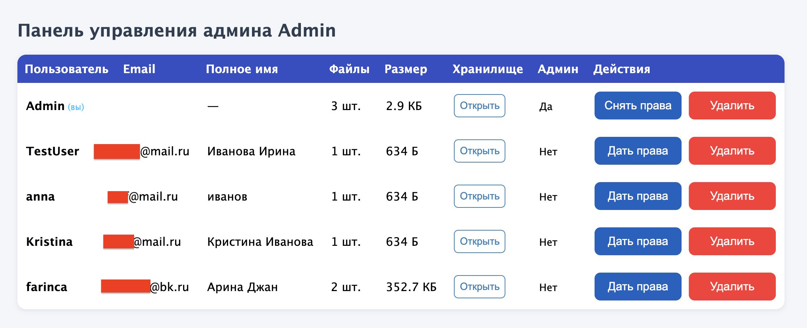
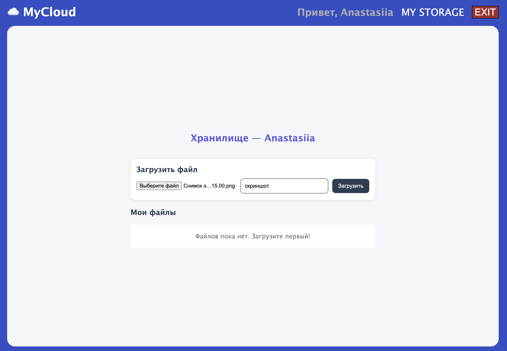
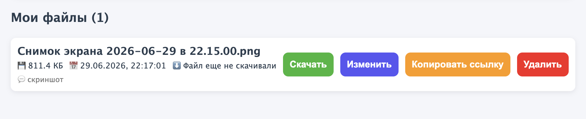

# Облачное хранилище My Cloud
  
> Fullstack пет-проект: веб-приложение, которое работает как облачное хранилище. Приложение позволяет пользователям отображать, загружать, отправлять, скачивать и переименовывать файлы.
 
     

---
## Какие результаты я получила


Мне хотелось понять полный цикл разработки продукта — от идеи до живого сервера.
Выбрала облачное хранилище, потому что оно затрагивает сразу несколько сложных тем:
работа с состоянием на фронте, REST API на бэке, авторизация и персистентность данных (способность программ сохранять данные).

- получен опыт разработки комплексного приложения, включающего в себя бэкенд и фронтенд;
- применены знания языка Python и фреймворка Django при разработке бэкенда;
- применены знания языка JavaScript и библиотек React при разработке фронтенда;
- получен опыт развёртывания приложения в облачной инфраструктуре reg.ru;

---

## Стек

| Слой | Технология |
- | Frontend | React 19, CSS Modules, AI animated banner |
- | Backend | Django 6.0.5, Django REST Framework |
- | База данных | PostgreSQL |
- | Деплой | Ubuntu 26.0 (reg.ru), Nginx, Gunicorn |
- | Аутентификация/Авторизация | SessionAuthentication |
- | Тестирование | Pytest 9.0.3 |

---

## Что есть внутри?

- регистрация, авторизация, общая информация







- валидация полей при регистрации



- админ-зона с доступом ко всем хранилищам



- собственное хранилище пользователя



- пользователь может: загрузить файл, добавить/отредактировать комментарий к файлу, скачать файл, скопировать внешнюю ссылку на файл и поделиться с любым пользователем (даже незарегистрированным), удалить файл, ознакомиться с: весом файла, датой добавления файла, датой скачивания файла.



- выход из приложения

---

## Что было сложно и как я это решила

**Проблема:** В форме регистрации на фронтенде не было валидации на стороне клиента перед отправкой на сервер. Это ухудшало UX.

**Решение:** Перенесла валидацию ошибок с бэкенда на фронтенд.


**Проблема:** Специальная внешняя ссылка генерировалась через uuid.uuid4().hex. Этого было недостаточно для анонимности.

**Решение:** Добавила соль через модуль secrets для гарантии уникальности и непредсказуемости


# My Cloud — BAСKEND    
    
Репозиторий содержит серверную часть веб-приложения на базе фреймворка Django (Python).     
  
---    
 ## ☁️ Структура проекта *   `my_project_jango/` - основная папка конфигурации Django проекта.    
    *   `settings_local.py` - базовые настройки проекта (для разработки, DEBUG=True).    
    *   `settings_production.py` - настройки для продакшн-сервера.    
    *   `urls.py` - главный маршрутизатор запросов.    
*   `storage/` - папка по управлению хранилищем приложения  
    *   `admin.py` - регистрация модели File  
    *   `apps.py` - конфигурация и метаданные приложения storage  
    *   `models.py` - описание модели File  
    *   `serializers.py` - сериализатор модели File  
    *    `urls.py` - маршрутизаторы запросов обработчиков приложения  
    *    `views.py` - обработчики:  
         * загрузка файлов  
         * просмотр файлов  
         * удаление файлов  
         * переименование файлов  
         * скачивание файла  
         * формирование спец ссылки  
         * скачивание по спец ссылке в тч внешними неавторизованными пользователями  
*   `<users>/` — папка папка по управлению пользователями приложения  
    *   `admin.py` - регистрация модели User  
    *   `apps.py` - конфигурация и метаданные приложения users  
    *   `models.py` - описание модели User  
    *   `serializers.py` - сериализатор модели User  
    *    `urls.py` - маршрутизаторы запросов обработчиков приложения  
    *    `views.py` - обработчики:  
         * регистрация  
         * логин  
         * логаут  
         * получение списка юзеров (только админ)  
         * удаление юзера (только админ)  
         * изменение значения признака “администратор” (только админ)  
*   `<tests>/` — папка c тестами API части для users/.    
*   `media/` — директория для пользовательских загружаемых медиа-файлов (изображений).    
*   `requirements.txt` — список зависимостей проекта.    
*   `manage.py` — утилита командной строки Django для управления проектом.    
    
---    
 ## ☁️ Инструкция по общему развёртыванию приложения    
 Приложение разворачивается на сервере Ubuntu с использованием связки Gunicorn, Nginx и окружения Python.    
  
### Предварительные требования   
- Ubuntu 22.04+  
- Python 3.10+  
- PostgreSQL 14+  
- Node.js 20+  
- Nginx  
  
### Ссылки на репо  
- Backend: https://github.com/Anastas0812/back-MYCLOUD  
- Frontend: https://github.com/Anastas0812/front-MYCLOUD  
  
### Открытые порты  
На сервере должны быть открыты порты:   
- 80 (HTTP)   
- 22 (SSH)  
  
### Шаг 0. Подготовка сервера  
1. Создайте системного пользователя:  
```bash  
ssh root@ip_вашего_сервера
adduser ваш_юзер 
password  
usermod ваш_юзер -aG sudo
su ваш_юзер
```

2. Установите необходимые пакеты:  
```bash  
cd ~
sudo apt update
password  
sudo apt install python3-venv python3-pip postgresql nginx
sudo systemctl start ngnix
sudo systemctl status ngnix  
#должен быть active
git --version
```

3. Склонируйте проект(бэкенд) с githhub:  
```bash  
git clone {Backend}
```  
4. Командой ``ls`` опускаемся до папки, в которой лежит ``manage.py`` и переходим в нее с помощью ``cd``  
5. Промежуточный итог (где вы?) - ``ваш_юзер@IP_вашего_сервера:~/папка_с_файлом_manage.py$``  
  
### Настройка базы данных  
1. Создайте базу данных и пользователя:  
```bash  
sudo -u postgres psql
```  
  
```sql  
CREATE DATABASE my_cloud;  
ALTER USER postgres WITH PASSWORD 'ваш_пароль_бд';  
\q  
exit  
```  
  
### Настройка переменных окружения  
Для управления конфигурацией приложение использует пакет ``python-dotenv``.   
В коде инициализация выглядит следующим образом:  
```python  
from dotenv import load_dotenv  
load_dotenv()  
```  
  
1. Создайте файл `.env` в корне проекта (`/home/ваш_юзер/back-MYCLOUD/.env`):  
```bash  
nano .env
```  
  
```env  
DB_NAME=my_cloud  
DB_USER=postgres  
DB_PASSWORD=ваш_пароль_бд  
DB_HOST=localhost  
DB_PORT=5432  
SECRET_KEY=ваш_секретный_ключ  
DEBUG=False  
```  
2. Сохраните файл: ``Ctrl+S`` → ``Ctrl+X`` или смотрите подсказки блокнота для выхода.  
3. Убедитесь что `.env` добавлен в `.gitignore`.  
*рекомендуется использовать генератор ключей для SECRET_KEY, например https://djecrety.ir/*  
  
4. Создайте и активируйте виртуальное окружение Python:  
```bash  
python3 -m venv env
source env/bin/activate
```  
5. Установите необходимые зависимости:  
```bash  
pip install -r requirements.txt
```  
6. Выполните миграции базы данных и соберите статику Django:  
```bash 
python manage.py migrate
python manage.py collectstatic --noinput
```  
  
### Создание суперпользователя  
```bash  
python manage.py createsuperuser
```  
После создания установите флаг `is_admin=True`:  
```bash  
python manage.py shell
```  
```python  
from users.models import User  
user = User.objects.get(username='ваш_логин')
user.is_admin = True 
user.save()
exit()  
```  
  
### Настройка Gunicorn  
1. Установится из зависимостей. Проверяем, что слушает нас:  
```bash  
gunicorn твоя_папка.wsgi:application --bind 0.0.0.0:8000
```  
2. Создайте файл   
```bash  
sudo nano /etc/systemd/system/gunicorn.service
```  
```ini  
[Unit]  
Description=Gunicorn  
MyCloud After=network.target  
  
[Service]  
User=ваш_юзер  
Group=www-data  
WorkingDirectory=/home/ваш_юзер/back-MYCLOUD  
ExecStart=/home/ваш_юзер/back-MYCLOUD/env/bin/gunicorn \
    my_project_jango.wsgi:application \ 
          --bind 127.0.0.1:8000 \ 
          --workers 3Restart=always  
RestartSec=5  
  
[Install]  
WantedBy=multi-user.target  
```  
3. Проверка  
```bash  
sudo systemctl start gunicorn
sudo systemctl enable gunicorn
sudo systemctl status gunicorn  
# должен быть active
```  
  
### Работа с фронтендом  
1. Склонируйте проект(фронтенд) с githhub:  
```bash  
cd ~git clone {Frontend}
cd front-MYCLOUD
```  
2. Установка Node.js  
```bash  
curl -fsSL https://deb.nodesource.com/setup_20.x | sudo -E bash -
sudo apt install nodejs
```  
3. Установка зависимостей, сборка  
```bash  
npm installnpm run build  # появится папка dist/
```  
  
### Настройка Nginx  
  
1. Создайте файл   
```bash  
sudo nano /etc/nginx/sites-available/mycloud
```  
  
```ngnix 
server {  
	listen 80;
	server_name ВАШ-IP;
	client_max_body_size 100M;
	
	location / {   
		root /home/ваш_юзер/front-MYCLOUD/dist;
		index index.html;
		try_files $uri $uri/ /index.html;
		}
		
	location /api/ {
		proxy_pass http://127.0.0.1:8000;
		proxy_set_header Host $host;
		proxy_set_header X-Real-IP $remote_addr;
	}
	
	location /media/ {
		alias /home/ваш_юзер/back-MYCLOUD/media/;
	}
	
	location /static/ {
		alias /home/ваш_юзер/back-MYCLOUD/staticfiles/;
	}
}  
```  
2. Активация конфигов, проверка, что нет ошибок, перезапуск  
```bash  
sudo ln -s /etc/nginx/sites-available/mycloud /etc/nginx/sites-enabled/
sudo nginx -t 
sudo systemctl restart nginx
```  
  
### Права доступа  
  
```bash  
chmod 755 /home/ваш_юзер
chmod -R 755 /home/ваш_юзер/front-MYCLOUD/dist
chmod -R 755 /home/ваш_юзер/back-MYCLOUD/staticfiles
chmod -R 755 /home/ваш_юзер/back-MYCLOUD/media
```  
  
### Известные особенности  
  
- Папка `logs/` создаётся вручную: `mkdir logs && touch logs/app.log` - `media/`, `logs/`, `.env` не хранятся в git — создаются на сервере вручную  
- Копирование ссылки работает только на HTTPS — на HTTP используется запасной метод через `execCommand` (handleCopyLink)  
- Загрузка файлов ограничена 100МБ (настраивается в Nginx client_max_body_size  100M;)  
- Перед ``npm run build`` обновить front-MYCLOUD/src/api/api.ts — заменить localhost на IP_вашего_сервера  
- ``settings_production.py`` - ALLOWED_HOSTS, CORS_ALLOWED_ORIGINS заменить IP_вашего_сервера 
  
### Перезапуск nginx и gunicorn если что-то пошло не так  
БЭКЕНД  
```bash  
cd ~/back-MYCLOUD
source env/bin/activate
sudo systemctl restart gunicorn
```  
ФРОНТЕНД  
```bash  
cd ~/front-MYCLOUD
npm run buildchmod -R 755 /home/ваш_юзер/front-MYCLOUD/dist
sudo systemctl restart nginx
```

## 👩‍💻 Обо мне

Я fullstack-разработчик с бэкграундом в продукте и бизнесе.
До перехода в IT 7 лет работала в туроператоре TEZ TOUR, где участвовала в запуске GDS-платформы бронирования — писала баг-репорты, ставила задачи разработчикам, тестировала интерфейсы.
Это даёт мне понимание того, как продукт живёт у реального пользователя — не только как он написан.

[LinkedIn](https://www.linkedin.com/in/anastasy-zvyagintseva/) · [GitHub](https://github.com/Anastas0812)